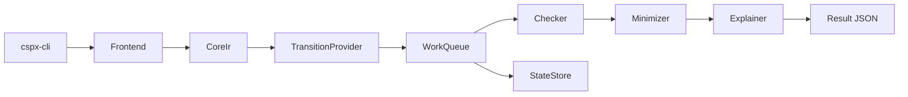

# アーキテクチャ（v0.1）

## 目的
- CI-first の要件（再現性/機械可読/配布容易）を満たすため、CLI とコアの責務境界を明確にする。
- 将来の性能スケール（並列/分散/ディスクバックストア）に備え、差し替え可能な trait 境界を初期から固定する。

## 主要コンポーネント（cspx-core）
- `Frontend`: CSPM の parse/typecheck を担当し、`CoreIr` を生成する。
- `CoreIr`: 中間表現（将来の解析/探索の入力）。
- `TransitionProvider`: state から遷移を生成する。
- `StateStore`: 状態保存（重複排除、永続化の差し替え点）。
- `WorkQueue`: 探索キュー（探索順の差し替え点）。
- `Checker`: assertion/refinement の抽象化。
  - M3 では `DeadlockChecker` を最小実装として追加。
- `Minimizer`: 反例最小化。
- `Explainer`: 原因タグ付与・ソースマッピング。
- `explore`（M2）: on-the-fly 探索の最小実装と統計収集。

## データフロー（概念）

## 設計方針
- CLI 層は `cspx-core` の公開 API のみに依存する（逆依存を禁止）。
- 依存は最小化し、差し替え可能なインタフェースを優先する。
- 反例/説明可能性は `Counterexample` / `SourceSpan` を中心に統一する。
