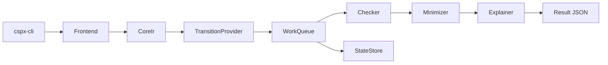

# アーキテクチャ（v0.1）

## 目的
- CI-first の要件（再現性/機械可読/配布容易）を満たすため、CLI とコアの責務境界を明確にする。
- 将来の性能スケール（並列/分散/ディスクバックストア）に備え、差し替え可能な trait 境界を初期から固定する。

## 主要コンポーネント（cspx-core）
- `Frontend`: CSPM の parse/typecheck を担当し、`CoreIr` を生成する。
- `CoreIr`: 中間表現（将来の解析/探索の入力）。
- `TransitionProvider`: state から遷移を生成する。
- `StateStore`: 状態保存（重複排除、永続化の差し替え点）。
  - M5 では `DiskStateStore` を追加（簡易な永続化）。
  - v0.2 では `state.log` / `state.idx` / `state.lock` の 3 ファイル構成。
- `WorkQueue`: 探索キュー（探索順の差し替え点）。
- `Checker`: assertion/refinement の抽象化。
  - M3 では `DeadlockChecker` を最小実装として追加。
- M4 では `RefinementChecker` を最小実装として追加。
- `Minimizer`: 反例最小化。
- `Explainer`: 原因タグ付与・ソースマッピング。
- `explore`（M2）: on-the-fly 探索の最小実装と統計収集。
- `explore_parallel`（M5）: 並列探索（スレッド数指定）。

## データフロー（概念）

## 設計方針
- CLI 層は `cspx-core` の公開 API のみに依存する（逆依存を禁止）。
- 依存は最小化し、差し替え可能なインタフェースを優先する。
- 反例/説明可能性は `Counterexample` / `SourceSpan` を中心に統一する。

## Minimizer 契約（Phase 5 / v0.1）
- 入力: checker が返した fail 時の `Counterexample`。
- 出力: `Counterexample` の形状（`type/tags/source_spans`）は保持し、`events` のみ短縮対象とする。
- 不変条件: 最小化後も「fail を再現できること」を oracle（`preserves_failure`）で検証する。
- アルゴリズム: v0.1 は **single-event deletion の貪欲法**（局所最小）。
- `is_minimized`: oracle 検証のうえ「これ以上 1 イベント削除しても fail を維持できない」場合のみ `true`。
  - これは局所最小を意味し、グローバル最短（最小長）を保証しない。

## SourceSpan 伝播（Phase 5 / v0.1）
- parser/typecheck が付与した `Spanned<ProcessExpr>.span` を IR で保持する。
- checker は `counterexample_span`（`crates/cspx-core/src/counterexample_span.rs`）経由で反例へ span を写像する。
- property assertion 選択時は、選択された対象 process の span を優先して `counterexample.source_spans` に反映する。
- refinement では spec/impl 双方の span を収集し、重複除去した上で反例へ付与する。

## スケール設計
- DiskStateStore / explore_parallel の仕様は `docs/scale.md` を参照。
