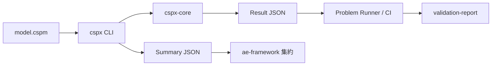

# 拡張システム全体像（v0.2）

## 1. この文書の目的
本書は、`cspx` の拡張後システムを「実装・運用・連携」の3視点で短時間に把握するための全体ガイドである。

対象読者:
- 開発者（機能追加、性能改善）
- CI 運用者（回帰検知、証跡管理）
- 連携先担当者（`ae-framework` への組み込み）

## 2. システム境界
拡張後のシステムは、次の4層で構成される。

1. **検査エンジン層**（`crates/cspx-core`）
   - Frontend（parse/typecheck）
   - LTS 生成 / 探索（single + parallel）
   - Checker（deadlock/divergence/determinism/refinement）
   - Minimizer / Explainer
   - StateStore（in-memory / disk / hybrid）
2. **CLI 層**（`crates/cspx-cli`）
   - `typecheck` / `check` / `refine` 実行
   - JSON/Text 出力、exit code、summary 出力
3. **品質保証層**（`problems/`, `scripts/run-problems`）
   - fast/bench 問題集、期待値評価、決定性比較
4. **外部連携層**（`docs/integrations/ae-framework.md`）
   - `--summary-json` による `ae-framework` 集約連携

## 3. End-to-End フロー


要点:
- **Result JSON** は検査詳細（checks/counterexample/metrics）を保持
- **Summary JSON** は連携先が扱う最小契約（status/resultStatus/exitCode）
- Problem Runner は Result JSON を期待値制約で評価し、`problems/.out` に証跡化

## 4. 機能領域（拡張済み）
### 4.1 検査コマンド
- `cspx typecheck <file>`
- `cspx check --assert <ASSERT> <file>`
- `cspx check --all-assertions <file>`
- `cspx refine --model T|F|FD <spec> <impl>`

### 4.2 出力契約
- CLI status: `pass | fail | unsupported | timeout | out_of_memory | error`
- exit code: `0..5`（`docs/cli.md`）
- Result JSON: `docs/result-json.md`
- Summary JSON: `schemas/csp-summary.schema.json`

### 4.3 Explainability
- 反例に `tags` と `source_spans` を付与
- `kind:*` / `model:*` / 原因タグを運用
- `is_minimized` は最小化保証状態を明示

### 4.4 スケール/性能（Plan C 反映）
- `DiskStateStore`（`state.log` / `state.idx` / `state.lock`）と再構築導線
- `HybridStateStore`（memory 優先 + spill）
- `explore_parallel` の deterministic 要件
- `--explore-profile` によるホットパス可視化
- `bench` baseline 比較（warn/fail 閾値）

## 5. 品質保証モデル
### 5.1 Problem Suite の役割
- `fast`: PR CI の必須回帰検知
- `bench`: nightly/manual の性能観測

### 5.2 期待値評価の考え方
- 完全一致ではなく **制約評価**（`in/min/max/contains`）
- 現機能境界の固定のため、問題によっては `unsupported/error` を暫定許容
- 決定性検証は `repeat + normalized_json_equal` を使用

### 5.3 証跡
- 実行ごとに `problems/.out/<P###>/` を保存
- 監査向けには `docs/validation-report.md` と日付版を保持

## 6. ae-framework 連携の要点
連携時の最重要点は「詳細と集約の分離」である。

- 詳細: `--output` で `cspx-result.json`
- 集約: `--summary-json` で `csp-summary.json`
- 連携先は `status/resultStatus/exitCode/backend` を主キーに集約

推奨運用:
- `cspx` バージョンは tag/commit pin 固定
- Result JSON の `schema_version=0.1` 互換前提で受理
- unknown フィールドは互換拡張として扱う

## 7. 運用シナリオ
### 7.1 開発者ローカル
```sh
cargo build -p cspx
cargo test
scripts/run-problems --suite fast --cspx target/debug/cspx
```

### 7.2 性能観測
```sh
cargo build -p cspx --release
scripts/run-problems --suite bench --cspx target/release/cspx --measure-runs 5 --warmup-runs 1
```

### 7.3 連携検証（例）
```sh
cspx typecheck spec.cspm \
  --format json \
  --output artifacts/cspx-result.json \
  --summary-json artifacts/csp-summary.json
```

## 8. 既知の制約
- Frontend は CSPM 全機能を未対応（サブセット運用）。
- 問題集には、機能境界固定のため `unsupported/error` 許容ケースがある。
- 反例最小化は常にグローバル最短を保証しない（局所最小の扱い）。

## 9. 拡張ポイント（次フェーズ）
- 期待値スキーマに組み合わせ制約（anyOf 相当）を導入
- FD 重経路の実装拡張後に `unsupported/error` 暫定期待値を段階解除
- 外部KV/分散バックエンドへの差し替え境界を具体化

## 10. 参照マップ
- アーキテクチャ: `docs/architecture.md`
- CLI 仕様: `docs/cli.md`
- Result JSON: `docs/result-json.md`
- Explainability: `docs/explainability.md`
- スケール設計: `docs/scale.md`
- ae-framework 契約: `docs/integrations/ae-framework.md`
- Problem Suite: `problems/README.md`
- 検証レポート: `docs/validation-report.md`
